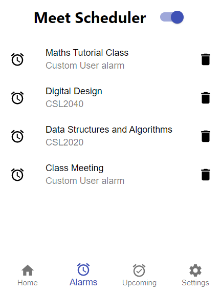
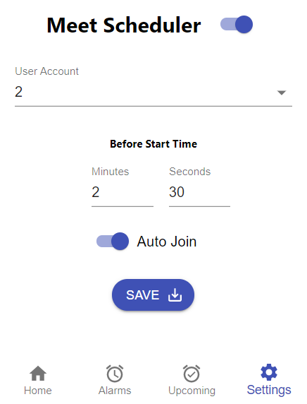
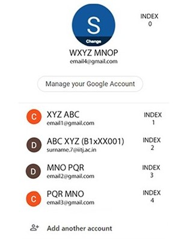

We are all fed up of keeping track of google meet/ zoom links for our meetings. This chrome extension makes your life easy!
You just have to enter the start and end (optional) time of your meeting in the `Custom` Tab and this extension would auto join and auto leave the meeting for you!🚀

Students from IIT Jodhpur can select their slots and courses from the `Student` Tab 🎓

## Tech stack

React JS ⚛️ has been used in frontend and the backend workflow is established mainly using `chrome.storage` and `chrome.alarms` ⏰

## Description

- To add an alarm, add the link and set the start and end (optional) time in the `Custom` Tab
- IIT Jodhpur students can also select from the Slot and Course list in the `Student` Tab
- The switch on the top is an on/off switch for the extension. If you turn it off, no alarms will get triggered.

- The `Alarm` tab shows a list of all the alarms

- The `Upcoming` tab shows you the alarms set for _Today_, _Tomorrow_ and _Later_
  - If you want to urgently join the meeting, just click on the course code given in the list. It will take you to the meeting!
  - If you want to silent an alarm or don't want it to ring because of some reason, click on the `tick mark` on the left to turn it off/on.

- The most important thing for the auto join feature to work is the `User Account` and the `Auto Join` switch in the <b>Settings</b> tab.
  Similarly, the auto leave function won't work if the `Auto Leave` switch is turned off.

- The image above shows some of the accounts a user might have registered in chrome. To use the <b>Auto Join</b> feature, the user must see the index of his/ her account using which they want to join the meeting (IIT Jodhpur students must check the index of their IITJ email id) and select that number in the `User Account` dropdown list. Here, the index shown is 2 and therefore 2 is selected in the `User Account` dropdown list.
- If the Auto Join switch is turned off in the Settings tab, alarm will ring and the link will get opened but it won't auto join the meeting for you.
- If the Auto Leave switch is turned off in the Settings tab, the Auto Leave feature won't work even if you had entered the end time.

- You can even customize the start time according to you. By default the start time is set to 30 seconds before the meeting time. What this means is that if the alarm is set for _4:00:00 pm_, the link will get opened at _3:59:30 pm_. One can change it to anything according to his/ her convenience.

#### If you want to contribute to this project:

## Steps to run locally

1. Make sure you have [Node.js](https://nodejs.org/en/download/) (v14.x) installed on your machine
1. Clone this repository `git clone https://github.com/devlup-labs/meet-scheduler.git`
1. Run `npm install` to install the dependencies
1. Run `npm start`
1. Load your extension on Chrome:
   1. Go to `chrome://extensions/`
   1. Turn on `Developer mode`
   1. Click on `Load unpacked extension`
   1. Select the `build` folder and upload it
